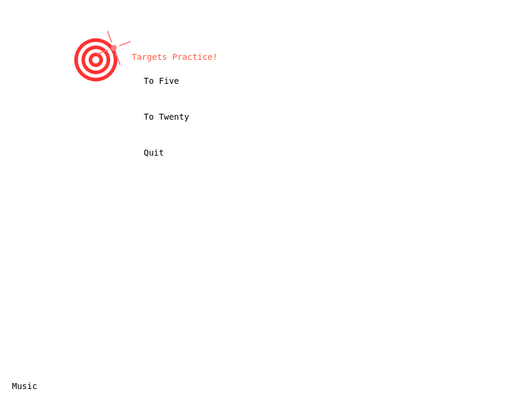
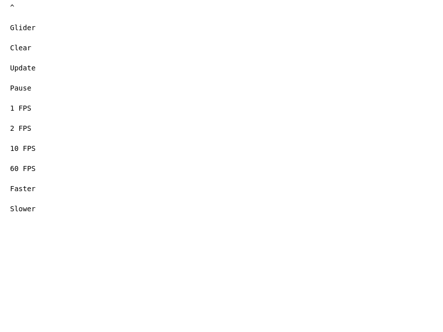

# Wasm-WebCanvas-Runtime

This is a simple runtime for running WebAssembly code that provides to said code a small game engine, in the form of a chunk of the 2D Canvas API and small WebAudio oscillator channel API.

All the code behind loading the WASM is in `loader.js`. `index.html` is a simple interface providing a dropdown to select from the Zig-generated WASM example files, and a button to run the selected example.

The WASM code is generated by Zig from the `examples` directory. `examples/interface.zig` defines the functions that the WASM code can call. Every other file in `examples` is a separate example that uses that interface.

## Why does this exist?

I had a 24 hour binge over Memorial Day weekend 2024 where I wanted to combine some things I'd heard:

* WASM being a good target for running portable code in the browser
* The 2D Canvas API being something simple enough to forward to WASM code (See: [TSCoding's great work cross-compiling C](https://youtu.be/Bafo3hhheHU).)
* Zig being super effective at cross-compilation (and WASM, as a result) because it doesn't rely on LibC (See: [This talk on Zig](https://youtu.be/5_oqWE9otaE).)

I had a basic Canvas API forwarder working in a few hours, and then I spent some evening time relaxing and doing other things, then the next day woke up and spent all day building fancier demos and the audio API.

## How do I use this?

Strictly speaking, you don't. This is a toy project. But if you want to, anything that follows the interface defined in `examples/interface.zig` can be compiled to WASM and run in this runtime. Just also define `init` and `draw` functions in your WASM code, and they'll be called by the runtime. `mousedown`, `mouseup` and `mousemove` all do what they say if you define them. I have `keyup` and `keydown` defined to pass in the keycode, but haven't actually tested them and they probably don't work.

## Examples

All examples were written in Zig and compiled to WASM. They all use the same interface defined in `examples/interface.zig`. The two that need it also implement their own immediate-mode GUI system (just a button type) for where they need it.

### `examples/fizzbuzz.zig`

Simple example that uses the debug interface to print "Fizz" if the number is divisible by 3, "Buzz" if it's divisible by 5, and "FizzBuzz" if it's divisible by both. Otherwise prints the number.

It also draws two rectangles, the width of which is the current deltaTime in 1 centisecond per pixel.

Classic programming exercise, but it was the test app I used to get the whole thing working.

### `examples/targets.zig`

A small game where you click on the target to score points, with an animated main menu. The target moves around the screen and several visual and audio effects are used to make it more engaging.

### `examples/life.zig`

Conway's Game of Life. Click to toggle cells. (Dragging is currently very broken, but fun to fill a board with.)

The buttons on the left side can be hidden and allow changing the speed, clearing the board, and tiling the board with gliders.